# Lara is Hiring 🏴‍☠️⚡

Un sistema di colloquio interattivo avanzato dove Lara Croft ti intervista per testare la tua conoscenza del mondo di Tomb Raider! Ora con **domande generate dinamicamente** e **completamento intelligente dei frame**!

## 🆕 Novità della Versione Avanzata

### 🎲 **Domande Generate Dinamicamente**
- **50% domande generate**: Sì/No create dalla knowledge base
- **50% domande tradizionali**: Domande aperte con frame da completare
- **Bilanciamento automatico**: Sistema intelligente per varietà ottimale

### 🎯 **Completamento Frame Intelligente**
- **Frame tradizionali**: Continua a chiedere fino al completamento totale
- **Frame generati**: Completamento automatico dopo risposta sì/no
- **Hint progressivi**: Lara ti guida verso le risposte mancanti

### ⚙️ **Flessibilità di Durata**
- **3 domande**: Colloquio breve (1-2 generate + 1-2 tradizionali)
- **5 domande**: Colloquio medio (2-3 generate + 2-3 tradizionali)
- **10 domande**: Colloquio completo (5 generate + 5 tradizionali)

## 📋 Descrizione del Progetto

**Lara is Hiring** è un sistema conversazionale intelligente di nuova generazione che simula un colloquio di lavoro condotto da Lara Croft. Il sistema combina domande generate dinamicamente dalla knowledge base con domande tradizionali strutturate, garantendo un'esperienza sempre diversa e coinvolgente.

## 🎯 Caratteristiche Principali

### 🤖 **Interazione Multimodale**
- **Sintesi Vocale**: Lara "parla" con voce femminile inglese
- **Riconoscimento Vocale**: Riconosce le risposte parlate dell'utente
- **Modalità Testuale**: Alternativa per input da tastiera

### 🧠 **Intelligenza Artificiale Avanzata**
- **NLG Dinamico**: Genera domande sì/no dalla knowledge base JSON
- **NLG Tradizionale**: Catene di Markov e SimpleNLG per risposte
- **NLP Avanzato**: Analisi semantica con spaCy italiano
- **Sistema Frame Intelligente**: Completamento automatico vs. manuale
- **Memoria Conversazionale**: Evita ripetizioni e mantiene contesto

### 🎮 **Meccaniche di Gioco Evolute**
- **Sistema di Punteggio Dinamico**: Valutazione basata su errori/domande totali
- **Frame Ibridi**: Domande generate (auto-complete) + tradizionali (complete-all)
- **Feedback Personalizzato**: Risposte contestuali e tematiche
- **Progressione Intelligente**: Passa all'argomento successivo solo a frame completo
- **Rating Dinamico**: Da principiante a leggendaria in base alle performance

## 🏗️ Architettura del Sistema

```
src/
├── dialog_manager.py      # 🎯 Gestione colloquio con frame completion
├── nlg_simplenlg.py      # 🎲 Generazione domande dinamiche + SimpleNLG
├── nlg.py                # 📝 Generazione tradizionale (Markov)
├── analysis.py           # 🔍 Analisi NLP delle risposte utente
├── frame.py             # 📊 Gestione frame conversazionali
├── question.py          # ❓ Classe per le domande
├── questions_list.py    # 📚 Lista domande predefinite
├── constants.py         # ⚙️ Costanti di sistema
└── test_*.py           # 🧪 Suite di test per debugging

corpus/
├── questions.txt         # 33 domande predefinite
├── positive_answers.txt  # 20+ risposte positive tematiche
└── negative_answers.txt  # 20+ risposte negative creative

knowledge.json           # 🧠 Base di conoscenza completa per generazione
```

## 🎲 Sistema di Generazione Dinamica

### **Categorie di Domande Generate**
- **📖 Biografia**: Anno di nascita, famiglia, educazione, background
- **⚡ Caratteristiche**: Abilità fisiche, armi, competenze, tratti
- **🗺️ Avventure**: Luoghi visitati, artefatti, missioni, antagonisti
- **🎯 Fatti**: Curiosità, interpretazioni, dettagli specifici

### **Logica di Generazione**
```python
# Esempio di domanda generata
"Lara Croft è nata a Wimbledon?" → Risposta: SÌ (corretta)
"Lara Croft ha gli occhi blu?" → Risposta: NO (scorretta, sono marroni)
```

### **Bilanciamento Intelligente**
- **3 domande**: 1-2 generate + 1-2 tradizionali
- **5 domande**: 2-3 generate + 2-3 tradizionali  
- **10 domande**: 5 generate + 5 tradizionali

## 🎯 Sistema di Completamento Frame

### **Frame Tradizionali (Tipo 2)**
```
Domanda: "Quali attrici hanno interpretato Lara Croft nei film?"
Target: ["Angelina Jolie", "Alicia Vikander"]

Loop fino a completamento:
1. Utente: "Angelina Jolie" → Frame incompleto, continua
2. Lara: "Ci sono altri dettagli da scoprire..."
3. Utente: "Alicia Vikander" → Frame completo! ✅
4. Passa all'argomento successivo
```

### **Frame Generati (Tipo 3)**
```
Domanda: "Lara Croft è britannica?"
1. Utente: "Sì" → Valutazione immediata
2. Frame completato automaticamente ✅
3. Passa all'argomento successivo
```

## 📚 Base di Conoscenza Espansa

Il sistema include una knowledge base JSON strutturata con:

- **👤 Biografia**: 15+ fatti su nascita, famiglia, educazione
- **⚡ Caratteristiche**: 20+ dettagli su abilità, armi, competenze
- **🗺️ Avventure**: 50+ informazioni su giochi TR I-VI, luoghi, artefatti
- **🎭 Fatti**: 30+ curiosità, citazioni, interpretazioni cinematografiche

## 🚀 Installazione

### Prerequisiti
```bash
pip install -r requirements.txt
```

Il file `requirements.txt` include:
```
spacy>=3.8.0
markovify>=0.9.4
pyttsx3>=2.90
SpeechRecognition>=3.10.0
pyaudio>=0.2.11
jinja2>=3.1.6
```

### Installazione Modello spaCy Italiano
```bash
python -m spacy download it_core_news_md
```

### Configurazione Audio (Opzionale)
Per il riconoscimento vocale:
- **macOS**: `brew install portaudio`
- **Ubuntu**: `sudo apt-get install portaudio19-dev`
- **Windows**: Di solito incluso

## 🎮 Come Utilizzare

### Avvio del Sistema
```bash
cd src/
python dialog_manager.py
```

### Menu di Scelta
```
=== COLLOQUIO CON LARA CROFT ===
Scegli la durata del colloquio:
1. Colloquio breve (3 domande)
2. Colloquio medio (5 domande) [default]
3. Colloquio completo (10 domande)
Inserisci la tua scelta (1-3): 2
```

### Esempio di Sessione Avanzata
```
=== ARGOMENTO 1/5 ===

Argomento 1/5 - Interazione 1
Frame: 0/2 risposte trovate
Risposte rimanenti: ['angelina jolie', 'alicia vikander']
Frame completo: ❌ NO

[Argomento 1/5 - Domanda 1] Quali attrici hanno interpretato Lara Croft nei film?
Avventuriero: Angelina Jolie

Frame: 1/2 risposte trovate
Risposte trovate: ['angelina jolie']
Risposte rimanenti: ['alicia vikander']

Lara Croft: Ci sono altri dettagli da scoprire su questo argomento...

[Argomento 1/5 - Domanda 2] Quali attrici hanno interpretato Lara Croft nei film?
Avventuriero: Alicia Vikander

[DEBUG] Frame completato dopo 2 interazioni!
Lara Croft: Perfetto! Hai esplorato completamente questo argomento. Passiamo al prossimo!

=== ARGOMENTO 2/5 ===

[DEBUG] Domanda generata: 'Lara Croft è nata a Wimbledon?'
[DEBUG] Intenzionalmente CORRETTA

[Argomento 2/5] Lara Croft è nata a Wimbledon?
Avventuriero: sì

[DEBUG] Domanda generata completata automaticamente
Lara Croft: Fantastico! Come trovare lo Scion di Atlantide in una sola mossa!
```

## 🎯 Sistema di Valutazione Dinamica

### **Calcolo Punteggio**
```python
punteggio = max(0, 100 - (errori * (100 / domande_totali)))
```

### **Rating Dinamico**
- **90-100 punti**: 🏆 **Leggendaria** - "Perfetto compagno d'avventura"
- **75-89 punti**: ⭐ **Straordinaria** - "Esploratore formidabile"  
- **60-74 punti**: 🎯 **Eccellente** - "Sopravvivi alle sfide comuni"
- **45-59 punti**: 📈 **Notevole** - "Conoscenza di base solida"
- **0-44 punti**: 🔰 **Principiante** - "Necessita miglioramenti"

### **Criteri di Valutazione**
- **Domande Generate**: Corretta = sì/no appropriato
- **Domande Tradizionali**: Corretta = risposta nel target del frame
- **Limite Errori**: Massimo 5 errori prima del fallimento
- **Bonus Completamento**: Frame completati correttamente

## 🔧 Personalizzazione Avanzata

### **Aggiungere Categorie alla Knowledge Base**
```json
{
  "nuova_categoria": {
    "fatti_veri": [
      "Lara Croft usa doppie pistole",
      "Tomb Raider è del 1996"
    ],
    "fatti_falsi": [
      "Lara Croft ha gli occhi blu",
      "Lara Croft è americana"
    ]
  }
}
```

### **Modificare Bilanciamento**
```python
# In dialog_manager.py
def create_question_plan(self):
    generated_count = int(self.total_questions * 0.6)  # 60% generate
    traditional_count = self.total_questions - generated_count
```

### **Personalizzare Hint**
```python
hints = [
    "Esplora più a fondo questo mistero...",
    "Quali altri segreti nasconde questo argomento?",
    "La tomba non ha ancora rivelato tutti i suoi tesori..."
]
```

## 🧪 Testing e Debugging

### **Suite di Test**
```bash
# Test completamento frame
python src/test_frame_completion.py

# Test generazione domande
python src/test_nlg_debug.py

# Test bilanciamento
python src/test_balance.py
```

### **Debug Mode**
Il sistema include debug dettagliato:
```
[DEBUG] Piano domande: 2 generate + 3 tradizionali = 5 totali
[DEBUG] Domanda generata: 'Lara Croft è britannica?'
[DEBUG] Intenzionalmente CORRETTA
[DEBUG] Utente ha risposto: sì
[DEBUG] Risposta dell'utente è: CORRETTA
[DEBUG] Frame completato dopo 2 interazioni!
```

## 🎭 Esempi di Risposte di Lara

### **Risposte Positive Contestuali**
- *"Fantastico! Come trovare lo Scion di Atlantide in una sola mossa!"*
- *"Perfetto! Neanche Lara Croft in persona avrebbe fatto meglio!"*
- *"Straordinario! Hai superato questa prova come Lara supera le trappole mortali!"*

### **Risposte Negative Creative**
- *"Attenzione, trappola mortale! Ritenta con più determinazione, avventuriero."*
- *"Mi spiace, ma nemmeno con due pistole questa risposta colpirebbe il bersaglio!"*
- *"'Odio le tombe' e odio anche le risposte sbagliate. Riprovaci."*

### **Hint per Frame Incompleti**
- *"Ci sono altri dettagli da scoprire su questo argomento..."*
- *"Cosa altro sai su questo tema?"*
- *"Continua l'esplorazione, c'è ancora molto da scoprire!"*

## 🛠️ Architettura Tecnica

### **Flusso di Esecuzione**

```mermaid
graph TD
    A[Avvio] --> B[Scelta Durata]
    B --> C[Creazione Piano Bilanciato]
    C --> D{Tipo Domanda?}
    D -->|Generata| E[Genera da KB]
    D -->|Tradizionale| F[Seleziona da Lista]
    E --> G[Risposta Sì/No]
    F --> H[Loop Frame]
    G --> I[Auto-Complete]
    H --> J{Frame Completo?}
    J -->|No| H
    J -->|Sì| I
    I --> K{Altre Domande?}
    K -->|Sì| D
    K -->|No| L[Valutazione Finale]
```


### **Componenti Principali**
- **DialogManager**: Orchestrazione con frame completion
- **NLG Advanced**: Generazione dinamica da knowledge base
- **Analysis**: NLP con riconoscimento sì/no e positività
- **Frame**: Gestione stato con check completamento
- **Knowledge Base**: JSON strutturato per generazione

## 🔮 Sviluppi Futuri

### **Funzionalità Pianificate**
- 🌐 **Multilingua**: Supporto inglese nativo
- 🎨 **UI Grafica**: Interfaccia web con avatar di Lara
- 📊 **Analytics**: Statistiche dettagliate delle performance
- 🤖 **AI Evoluta**: Integrazione con modelli linguistici avanzati
- 🎮 **Gamification**: Achievements e progressione utente

### **Contributi**
Il progetto è aperto a contributi! Aree di interesse:
- Espansione knowledge base
- Nuovi algoritmi di generazione
- Miglioramenti NLP
- Interfacce utente
- Testing automatizzato

## 📜 Licenza

Questo progetto è sviluppato per scopi educativi e di ricerca nel campo dell'NLP, AI conversazionale e sistemi di dialogo avanzati.

---

## 🏆 Statistiche del Sistema

- **📚 Knowledge Base**: 100+ fatti su Tomb Raider
- **❓ Domande Totali**: 33 tradizionali + ∞ generate
- **🎯 Combinazioni**: 1000+ possibili configurazioni
- **🧠 Intelligenza**: NLP + NLG + Frame Management
- **🎮 Esperienza**: Sempre diversa e coinvolgente

*"La straordinarietà è in ciò che facciamo, non in chi siamo."* - Lara Croft

**Buona fortuna, avventuriero! Che l'esplorazione abbia inizio!** 🗡️💎⚡ 